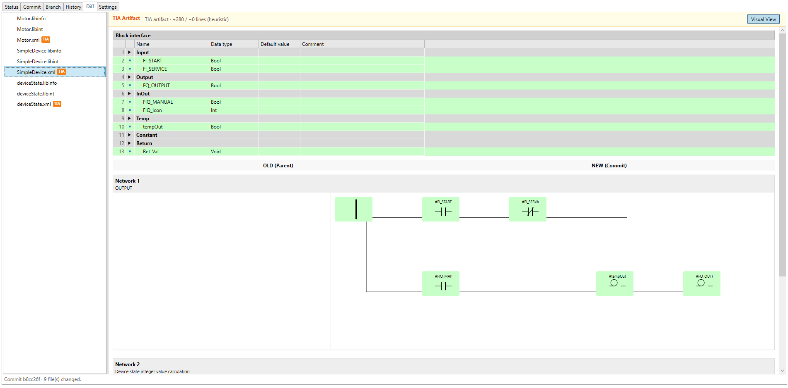

# TIA Git Add-In

TIA Portal V21 Add-In for working with Git from inside TIA Portal Version Control (VCI) workflows (finally).

The add-in targets `.NET Framework 4.8` and packages as a native TIA Portal V21 `.addin` file. It provides a specialized Git panel integrated directly into the TIA Portal UI, focusing on the unique needs of PLC developers using VCI.



## Features & Status

### Native SimaticML Decoding (NEW)

- **Zero Dependencies**: Completely removed dependencies on Node.js and external Siemens ACTool scripting.
- **Native Parser**: Custom C# `XDocument`-based parser for SimaticML files.
- **Structural Comparison**: Logic and interface are compared directly in C#, allowing for deep semantic diffing of PLC blocks.

### Visual LAD Diff

- **Side-by-Side View**: Compare "OLD" (parent) and "NEW" (commit/working tree) LAD networks horizontally.
- **Single-Commit State Detection**: Commit diff mode compares the selected commit against its parent, so the view reflects the state introduced by that commit.
- **Graphic Rendering**: Simplified geometric representation of Ladder Logic, including contacts, coils, boxes, powerrails, and orthogonal wires.
- **Branching Layout**: Custom layout engine handles multiple rungs and branch routing while hiding SimaticML-only routing helper nodes from the visual view.
- **Element-Level Highlighting**: Only the affected LAD components are colored, not the whole network. Yellow means changed or rewired, green means added on the new side, and red means removed from the old side.
- **Topology-Aware Changes**: Components are marked changed when their wiring moves, even if the underlying SimaticML part/call definition stays the same.

### TIA Portal V21 Compare API Decision

TIA Portal V21's supported Public API includes in-process, data-only comparison for TIA engineering objects (`PlcSoftware.CompareTo`, `PlcSoftware.CompareToOnline`, hardware/library comparisons) and coarse VCI mapped-object status. The engineering-object methods return comparison result trees; VCI exposes status data only. Neither surface provides Siemens' graphical LAD/FBD comparison editor or accepts Git/SimaticML revision files. The V21 Add-In API exposes no supported compare/diff UI entry point.

Git revision review therefore continues to use the native SimaticML comparer and custom LAD renderer, with the text/structured view as fallback. Internal `Siemens.Automation.CommonServices.Compare.*` UI and command types are not used. See the [V21 compare API investigation](docs/tia-v21-compare-api-investigation.md) for the evidence and decision matrix.

### Git Integration

- **VCI-Aware**: Automatically detects Git repositories associated with TIA Portal VCI workspaces.
- **Core Operations**: View status, history, and commit changes without leaving TIA Portal.
- **Transparent Execution**: Uses your local `git.exe` for all operations.

## Prerequisites

- **TIA Portal V21** (required for the Add-In API and Publisher).
- **.NET SDK** compatible with the repo `global.json`.
- **Local Git** installation available in system PATH.

## Build & Installation

### Build (only for locally built Add-In)

```powershell
dotnet restore TiaGitAddIn.sln
dotnet build TiaGitAddIn.sln --no-restore
```

The build process automatically packages the result into a `.addin` file using the Siemens Add-In Publisher:
`src/TiaGitAddIn/bin/Debug/net48/TiaGitAddIn.addin`

### Installation

1. Copy the `TiaGitAddIn.addin` file to your TIA Portal Add-Ins folder (typically `%TIA_INSTALL_DIR%\AddIns`).
2. Open TIA Portal V21.
3. Enable the Add-In in the "Add-ins" task card.
4. Right-click on a VCI workspace item to find the "Git" menu items.

## Development Roadmap

1. **Language Support**
   - Extend the visual diff to support **FBD** (Function Block Diagram).
   - Implement structured text diffing for **SCL** with block-aware syntax highlighting.

2. **Advanced Comparison**
   - Deep interface comparison (detecting changes in Datatypes, Retain settings, and Comments).
   - Block metadata comparison (Attributes, Optimized Access, etc.).
   - Multi-block comparison within a single commit.

3. **UI/UX Polishing**
   - Improved orthogonal wire routing for cleaner visual diagrams.
   - Interactive zooming and panning in the visual diff viewer.
   - Integration with TIA Portal's theme and system colors.

4. **HMI & Configuration**
   - Research visual diffing for HMI Screens and Tag Tables.
   - Support for comparing Hardware Configuration artifacts.

## Project Structure

```text
src/
  TiaGitAddIn/
    Entry/               TIA Portal Add-In entry points and menu registration
    UI/                  WPF MVVM (ViewModels, Views, Converters)
    Services/            UI-specific services and add-in implementations
  TiaGitAddIn.Core/
    Models/              Core data models for Git, LAD, and Sact/SimaticML
    Services/            Git process execution and repository discovery
    Services/SimaticMl/  Native SimaticML parser and comparison engine
    Configuration/       Configuration management
    Logging/             Add-in logging abstractions
  TiaGitAddIn.Tests/     Unit and UI logic tests
```
